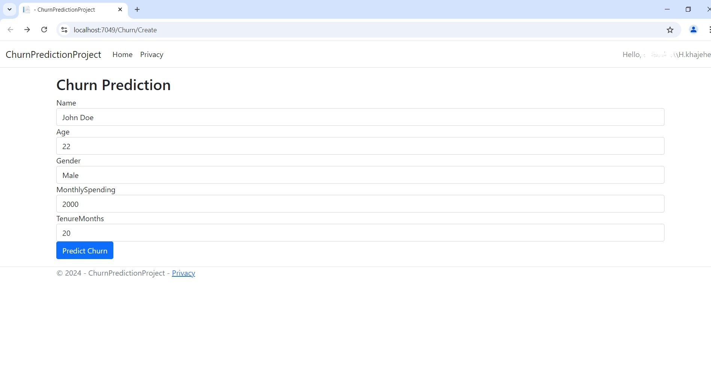
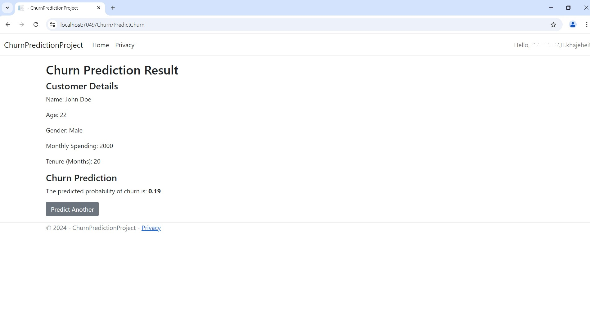

# Churn Prediction Project

This project provides a **Churn Prediction** application built with **ASP.NET Core MVC** and **Python** (Flask API). It is designed to help businesses identify customers who are likely to churn based on historical data, enabling data-driven decisions for customer retention strategies.

## Project Overview

Customer churn can significantly impact the profitability and growth of businesses. By predicting which customers are at risk of leaving, businesses can proactively implement strategies to improve customer satisfaction, offer personalized promotions, or provide targeted support to reduce churn. This application demonstrates a robust way to predict customer churn by integrating data science models with a user-friendly ASP.NET Core MVC interface.

### Key Features

- **Predict Customer Churn**: Leverages a machine learning model to predict the probability of a customer churning based on input attributes like age, tenure, monthly spending, and gender.
- **Business Insights**: Enables businesses to understand which customer segments are more prone to churn and prioritize retention efforts.
- **Easy-to-Use Interface**: Allows users to submit customer data through a form and view prediction results in a user-friendly interface.
- **Flask API Integration**: The Python (Flask) backend serves as the prediction engine, integrating seamlessly with the ASP.NET Core frontend.

### Technical Stack

- **ASP.NET Core MVC**: Serves as the frontend, handling user input, validation, and displaying prediction results.
- **Flask (Python)**: Implements the backend API with a machine learning model for churn prediction.
- **Machine Learning**: The churn prediction model is built with a supervised learning algorithm and is serialized with Joblib to allow easy loading and prediction.
- **SQL Database**: Stores customer data and churn prediction results for future reference and analysis.

## Getting Started

### Prerequisites

- **.NET 8.0 SDK** (or higher)
- **Python 3.12.3** (or higher)
- **Joblib** for model serialization
- **Flask** for API backend

### Installation

1. **Clone the Repository**:
   ```bash
   git clone https://github.com/hkhajei/ChurnPredictionProject.git
  
2. **Set up the Flask API**:

* Navigate to the FlaskAPI directory:
  ```bash
  cd FlaskAPI
  ```
* Install the necessary Python libraries:

  ```bash
  pip install -r requirements.txt
  ```
* Start the Flask server:

  ```bash
  python app.py
  ```
3. **Set up the ASP.NET Core MVC Project**:

* Open the ChurnPredictionProject.sln file in Visual Studio or use the command line to restore dependencies:
  ```bash
  dotnet restore
  ```
* Update the database connection string as needed in appsettings.json.

* Run the ASP.NET application:
  ```bash
  dotnet run
  ```
## Usage
### Predict Churn for a Customer
1. **Enter Customer Data**: Go to the /PredictChurn page and input the customer's details (age, gender, monthly spending, tenure).
2. **View Prediction Result**: The application sends the data to the Flask API for prediction and displays the likelihood of churn directly on the result page.
3. **Store Prediction**: Each prediction result is stored in the database, providing a historical record for further analysis.
### Example Use Case
This churn prediction model is tailored for customer success or marketing teams who want to reduce churn by identifying at-risk customers and taking preventative measures. For instance:

* **Preventative Measures**: Target high-churn customers with special loyalty programs or personalized offers.
* **Customer Success Strategies**: Enable customer support teams to reach out to at-risk customers and improve engagement.
* **Revenue Optimization**: Reduce customer acquisition costs by focusing on retention strategies, which are often more cost-effective than acquiring new customers.

## Project Structure
* ```ChurnPredictionProject``` - The main ASP.NET Core MVC application.
* ```FlaskAPI``` - A separate directory containing the Flask app for the prediction model.
* ```Models``` - C# classes representing entities such as Customer and ChurnPrediction.
* ```Controllers``` - C# controllers handling the application's business logic.
* ```Views``` - Razor views for rendering pages like customer input form and prediction results.
## Contributing
If you’d like to contribute, please fork the repository and create a pull request. Contributions to enhance the model accuracy, add additional features, or improve the frontend UI are highly appreciated!
## Screenshots



